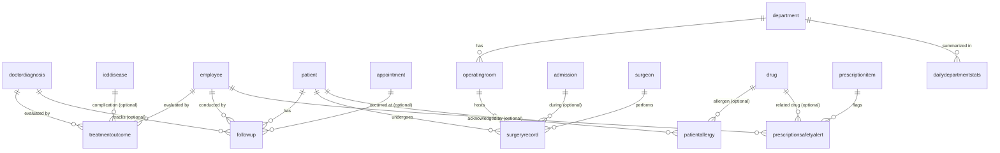

<div align="center">

# 🏥 Hospital Information System
### Database Design — Phase 2 (Analytics & Intelligence)


*A fully relational, fully operational Hospital Information System — now extended with treatment-outcome tracking, follow-up care, resource optimization, clinical decision support, and management reporting on top of the Phase 1 core.*

</div>

---

## 📋 Table of Contents

- [Overview](#-overview)
- [Modules — Phase 1 Core](#-modules--phase-1-core)
- [Modules — Phase 2 Analytics & Intelligence](#-modules--phase-2-analytics--intelligence)
- [Programmability Layer](#-programmability-layer)
- [Web Console](#-web-console)
- [Schema](#-schema)
- [Design Decisions](#-design-decisions)
- [Getting Started](#-getting-started)
- [Repository Structure](#-repository-structure)
- [Beyond Phase 2](#-beyond-phase-2)
- [Team](#-team)

---

## 🔍 Overview

This is a two-phase Hospital Information System (HIS) database. **Phase 1** built the operational core: patients, admissions, scheduling, staff, lab & imaging, pharmacy, inventory, billing, and IoT-based monitoring — with business rules enforced at the **database engine level**, not just assumed by whichever client happens to be connected.

**Phase 2** turns that operational data into decision support: it tracks how treatments actually turn out, follows chronic patients over time, measures service quality with real KPIs, gives Operating Rooms the same resource-tracking beds already had, catches unsafe prescriptions before they're filled, and pre-aggregates the numbers management actually looks at. Every Phase 2 table, function, trigger, procedure, and view is additive — nothing from Phase 1 was rewritten, only extended.

---

## 📦 Modules — Phase 1 Core

### 1 · Patient Management
> `patient` · `medicalrecord` · `insurance` · `icddisease` · `doctordiagnosis`

Patients are registered once using their **national ID** as the primary key. A single `medicalrecord` is linked to each patient (enforced via `UNIQUE`), storing prior conditions, prior drug use, **smoking history**, anthropometrics, and vitals. Diagnoses are recorded per encounter using standard **ICD codes**.

### 2 · Admissions & Appointments
> `appointment` · `admission` · `bed` · `patienttransfer`

Appointments support in-person and online booking with full status tracking (`Scheduled` / `Completed` / `Cancelled` / `Rescheduled`). Admissions tie a patient to a bed, a responsible physician, and entry/exit dates. Every ward-to-ward move during a stay is logged in `patienttransfer` — and a database trigger keeps bed occupancy correct automatically, regardless of which client made the change.

### 3 · Hospital Resources
> `department` · `bed`

Departments (ER, ICU, wards, OR, lab, pharmacy, radiology…) share one table with a `type` discriminator. Beds carry a live `status`: `Free` / `Reserved` / `Occupied`.

### 4 · Staff Management
> `employee` · `doctor` · `surgeon` · `nurse` · `adminstaff` · `shift` · `employeeshift`

ISA inheritance keeps role-specific attributes off the shared base table:

```
employee  (base: name, department, contract, phone, role)
  ├── doctor       → specialization, medicalLicenseNo
  ├── surgeon      → surgicalSpecialty
  ├── nurse        → grade
  └── adminstaff   → role
```

### 5 · Lab & Imaging
> `Labimagingrequest` · `labresult` · `isCritical` · `labalert`

`labresult.status` tracks the **workflow** (`Pending` → `Completed`); clinical severity lives on `labalert.severity` (`Normal` / `Moderate` / `Critical`), auto-populated the moment a result lands outside the range defined in `isCritical`:

```
Labimagingrequest → labresult ── isCritical (reference range)
                        │
                        ▼ (out of range — automatic, via trigger)
                    labalert ──── doctor
```

### 6 · Pharmacy & Electronic Prescriptions
> `prescription` · `prescriptionitem` · `drug` · `druginteraction`

Electronic prescriptions link to the originating appointment or admission. Every new prescription item is checked against `druginteraction` and (as of Phase 2) `patientallergy` — see [Clinical Decision Support](#-modules--phase-2-analytics--intelligence) below.

### 7 · Inventory
> `storage` · `storage_transaction`

Every stock movement is a `storage_transaction`; `storage.inventory` is a running total maintained automatically by trigger rather than typed in by hand.

### 8 · Financial
> `invoice` · `invoiceitem` · `paymentmethod` · `insurance` · `payment`

Invoices carry `total_amount` / `insuranceAmount` / `patientAmount`, recalculated automatically whenever `invoiceitem` rows change. Actual money received is logged separately in `payment` (a real payment ledger, distinct from the bill itself); `invoice.paidAmount` and `status` (`Unpaid` / `PartiallyPaid` / `Paid`) update automatically as payments come in.

### 9 · IoT & Smart Alerts
> `iotdevice` · `devicetransfer` · `logs` · `AlertThreshold` · `alert`

Devices (vitals wristbands, bed sensors, ambient sensors) move between patients and locations, tracked in `devicetransfer`. Every reading lands in `logs`; a trigger compares it against `AlertThreshold` — checking a **patient-specific override** first, falling back to the hospital-wide standard — and raises an `alert` automatically when a reading is out of range.

---

## 🧬 Modules — Phase 2 Analytics & Intelligence

### 10 · Longitudinal Treatment Analysis
> `treatmentoutcome`

Tracks how a diagnosed condition actually turned out — `Recovered` / `Improved` / `Unchanged` / `Worsened` / `Relapsed` / `Deceased` / `ReferredOut` — tied to the **disease** (`doctordiagnosis`) rather than the visit, so effectiveness and relapse rates can be compared *per disease*, which is the axis the brief actually asks about.

### 11 · Patient Monitoring & Follow-Up
> `followup`

Post-treatment check-ins: new symptoms, progress (`Improving` / `Stable` / `Worsening`), whether the treatment plan changed, and when the patient is due back. Optionally anchored to a chronic diagnosis or a formal appointment.

### 12 · Service-Quality KPIs
> `appointment.checkInTime / serviceStartTime / checkOutTime` (extended, not a new table)

Phase 1's `appointment` only ever recorded the *scheduled* slot. Three new timestamp columns capture what actually happened, powering real wait-time, length-of-stay, and 30-day readmission KPIs instead of estimates.

### 13 · Resource Optimization
> `operatingroom` · `surgeryrecord`

Beds already had full occupancy tracking; IoT devices already had `devicetransfer`. The one resource Phase 1 never modeled was the **Operating Room** — and the `surgeon` ISA subtype from Phase 1 had zero rows and zero references anywhere until now. `surgeryrecord` gives both a real job: scheduled/actual start & end times drive OR utilization and, via a trigger, keep `operatingroom.status` in sync automatically (the same pattern beds already use).

### 14 · Clinical Decision Support
> `patientallergy` · `prescriptionsafetyalert`

Drug-drug interaction checking already existed in Phase 1 (`druginteraction`) and abnormal-lab alerting already existed (`isCritical` / `labalert`) — the one gap was drug **allergies**. `patientallergy` closes it, and a new trigger checks every incoming prescription item against both interactions and allergies, logging every finding to `prescriptionsafetyalert` regardless of severity so nothing is silently missed.

### 15 · Management Reporting
> `dailydepartmentstats` + a set of analytical views

Per the brief's own suggestion, a pre-aggregated summary table sits alongside the reporting views — a `sp_RefreshDailyDepartmentStats` snapshot (occupancy, admissions, discharges, appointment volume, average wait) meant to run nightly, so a manager's dashboard reads one small table instead of re-scanning transactional data on every request.

---

## ⚙️ Programmability Layer

This is what makes both phases *operational* rather than just a diagram: the business rules below hold no matter what inserts the data — Flask, SSMS, or anything else.

**Functions** — patient age, admission length-of-stay, and appointment wait-time (all derived attributes, computed rather than stored); free-bed counts per department; drug-interaction and drug-allergy severity lookups; 30-day readmission flag; OR utilization percentage; session-identity helpers used by the security layer.

**Triggers** — bed status flips to `Occupied`/`Free` automatically on admission/discharge/transfer, and the same pattern now keeps `operatingroom.status` in sync with surgery timing; a critical lab result auto-generates a `labalert`; an out-of-range sensor reading auto-generates an `alert`; every new prescription item is checked for interactions/allergies and logged to `prescriptionsafetyalert`; `storage.inventory` and `invoice` totals stay in sync with their underlying transactions/items without anyone recalculating by hand.

**Stored procedures** — the actual operations staff perform: admit / discharge / transfer a patient, register a patient, record a lab result, log a sensor reading — and, as of Phase 2, record a treatment outcome, log a follow-up visit, record a patient allergy, schedule/start/complete a surgery, check a patient in/through/out of an appointment, and refresh the daily management snapshot.

**Views** — ready-to-query reporting surfaces: bed occupancy by department, active admissions, open lab/IoT alert queues, a patient's full drug history, role-scoped views that filter themselves based on who's logged in — plus, as of Phase 2, disease frequency, treatment effectiveness by disease, 30-day readmission rate, average length of stay, average wait time, OR status and busiest-department reporting, drug consumption, a pending-safety-alert review queue, and a doctor's upcoming follow-up queue.

**Security** — `UserAccount` holds hashed credentials; `sp_Login` authenticates and sets the caller's identity into `SESSION_CONTEXT` for that connection. SQL Server roles (`role_doctor`, `role_nurse`, `role_admin_staff`, `role_patient`, …) scope table/view/procedure grants per job function, and **Row-Level Security** policies mean a patient's own connection can only ever see rows about *them* — enforced by the engine, not by an app remembering to filter correctly.

---

## 🖥️ Web Console

A staff-facing Flask application (`hospital-web/`) sits on top of the schema — the graphical component the brief asked for, connected live to this database over the team's Tailscale-linked SQL Server.

| Module | What's there |
|---|---|
| **Dashboard** | Live bed board, hospital vitals strip, open-alert feed |
| **Patients** | Search/register/edit, medical record, ICD diagnoses, drug history |
| **Admissions** | Admit / discharge / transfer, with full bed-board integration |
| **IoT & Alerts** | Device registry, live sensor logs, alert queue (acknowledge / resolve) |
| **Lab & Imaging** | Requests + a dedicated critical-alert queue routed to the assigned doctor |
| **Staff · Appointments · Pharmacy · Inventory · Financial** | Live, database-backed views across the remaining modules |

> **Phase 2 status:** the database layer above (schema, functions, triggers, procedures, views, sample data) is complete. The Flask console does not yet have screens for surgeries, follow-ups, treatment outcomes, allergies, or the KPI/management dashboards — that's the next step, once this database layer is reviewed.

The visual design borrows its colour vocabulary directly from a bedside patient monitor — the same green/amber/red a nurse already reads at a glance carries the same meaning everywhere status appears (beds, alerts, lab results), rather than being decorative. Numbers and IDs are set in a monospace face to read like a digital readout.

---

## 🗺️ Schema

Full ERD covering all 37 Phase 1 tables and their relationships:


> The diagram above predates Phase 2 and doesn't yet include `treatmentoutcome`, `followup`, `operatingroom`, `surgeryrecord`, `patientallergy`, `prescriptionsafetyalert`, or `dailydepartmentstats`. Regenerate it with the team's usual Mermaid ERD tool once the Phase 2 schema is reviewed — a Mermaid snippet for just the new tables is below to paste in alongside the existing diagram source:



---

## 🧠 Design Decisions

| # | Decision | Why |
|---|----------|-----|
| 1 | **National ID as patient PK** | Natural, unique, immutable — no surrogate key needed |
| 2 | **UNIQUE on `medicalrecord.patientID`** | One comprehensive medical file per patient |
| 3 | **ISA inheritance for staff** | Avoids a flat table with many nullable columns |
| 4 | **Dual nullable FKs on service requests** | One table covers both outpatient and inpatient contexts |
| 5 | **Workflow status vs. clinical severity, kept separate** | `labresult.status` is a lifecycle state; `labalert.severity` is the clinical judgment — conflating them would make either one lie |
| 6 | **`payment` separate from `invoice`** | An invoice is a bill; a payment is money that actually arrived. Keeping them apart lets partial payments, prepayments, and refund scenarios stay honest |
| 7 | **`isGlobal` flag on `AlertThreshold`** | One table handles hospital-wide standards *and* per-patient physician overrides |
| 8 | **Business rules enforced by triggers, not just app code** | Bed status, alert generation, and running totals hold true regardless of which client — Flask, SSMS, a future mobile app — writes the data |
| 9 | **Row-Level Security over app-side filtering** | A patient's own login literally cannot query another patient's row, even with raw SQL access — the guarantee doesn't depend on every future query remembering a `WHERE` clause |
| 10 | **`treatmentoutcome` keys off `doctordiagnosis`, not `admission`** | "Compare treatment effectiveness across diseases" is a per-disease question; keying off the admission would make that join awkward for every outpatient case |
| 11 | **Extend `appointment` with timing columns instead of a new table** | Wait-time is a property of the visit that already exists — a parallel table would just need the same FK back to `appointment` |
| 12 | **Prescription safety trigger detects and logs, doesn't block** | An earlier draft used `INSTEAD OF INSERT` to hard-block Severe interactions, matching this README's own wording. Checked against the existing sample data, 8 patients already have Severe pairs in their prescription history (e.g. Warfarin+Ibuprofen) — a fresh install would have failed loading `sample.sql`. Real prescribing history legitimately contains monitored/overridden interactions; the trigger now logs every severity to `prescriptionsafetyalert` for staff review instead of rejecting the write |
| 13 | **`operatingroom` / `surgeryrecord` as new tables, not folded into `bed`** | An OR is booked in minutes-long windows for a single procedure, not occupied for a multi-day stay — different enough usage pattern to warrant its own status lifecycle rather than overloading `bed.status` |
| 14 | **`dailydepartmentstats` as a real aggregated table, not just a view** | The brief explicitly suggests aggregated tables for dashboard performance; a nightly-refreshed snapshot means a manager's dashboard query never has to re-scan `admission`/`appointment` directly |

---

## 🚀 Getting Started

### Prerequisites
- Microsoft SQL Server 2019+ and SSMS
- Python 3.10+ (for the web console)
- ODBC Driver 17+ for SQL Server

### 1 — Database

Run the SQL files **in order** against a fresh database:

```sql
CREATE DATABASE HospitalDB;
GO
USE HospitalDB;
GO
-- then execute, in this exact order:
-- 01_schemas.sql
-- 01b_phase2_schemas.sql
-- 02_functions.sql
-- 02b_phase2_functions.sql
-- 03_triggers.sql
-- 03b_phase2_triggers.sql
-- 04_procedures.sql
-- 04b_phase2_procedures.sql
-- 05_views.sql
-- 05b_phase2_views.sql
-- 06_security_login_system.sql
-- 07_sample.sql
-- 07b_phase2_sample.sql
```

Phase 2 files are additive extensions of their Phase 1 counterpart and must run immediately after it — schema before functions, functions before triggers, and so on, exactly like Phase 1. Both sample-data files must run last, in that order, since Phase 2's sample data references patients/admissions/diagnoses/prescriptions already loaded by Phase 1's.

Verify:
```sql
SELECT COUNT(*) FROM INFORMATION_SCHEMA.TABLES WHERE TABLE_TYPE = 'BASE TABLE';
-- Expected: 44

SELECT * FROM vw_PendingSafetyAlerts;
-- Expected: at least one Severe 'Allergy' row (Amoxicillin, patient 860-80-3546) —
-- confirms the Phase 2 safety trigger fired correctly during sample data load
```

### 2 — Web console

```bash
cd hospital-web
python3 -m venv venv && source venv/bin/activate
pip install -r requirements.txt
cp .env.example .env   # fill in your real SQL Server host/login
python3 run.py
```

Open `http://localhost:5000`.

*(Phase 2 screens aren't wired into the console yet — see [Web Console](#-web-console) above.)*

### Team access

Everyone connects to the same SQL Server instance over **Tailscale** — no port forwarding, no public IP.

---

## 📁 Repository Structure

```
├── 01_schemas.sql
├── 01b_phase2_schemas.sql
├── 02_functions.sql
├── 02b_phase2_functions.sql
├── 03_triggers.sql
├── 03b_phase2_triggers.sql
├── 04_procedures.sql
├── 04b_phase2_procedures.sql
├── 05_views.sql
├── 05b_phase2_views.sql
├── 06_security_login_system.sql
├── 07_sample.sql
├── 07b_phase2_sample.sql
├── ER diagram.png
├── hospital-web/            # Flask staff console (Phase 1 modules only, so far)
│   ├── app/
│   ├── requirements.txt
│   └── run.py
└── README.md
```

*(File names above use the team's numbered convention for clarity; the files as delivered are named `phase2_schemas.sql`, `phase2_functions.sql`, `phase2_triggers.sql`, `phase2_procedures.sql`, `phase2_views.sql`, and `phase2_sample.sql` — rename or number them however the repo already does.)*

---

## 🔮 Beyond Phase 2

What's genuinely still open, for whenever new requirements come in:

- **Web console coverage for Phase 2** — surgeries, follow-ups, treatment outcomes, allergies, and the KPI/management dashboards need Flask screens and routes
- **Updated ER diagram** — regenerate via the team's Mermaid tool using the snippet in [Schema](#-schema) above
- **Equipment inventory** — non-drug items registered in `storage` don't yet have in/out transaction history the way drugs do (`storage_transaction.drugID` is required)
- **A real login screen in the web console** — `sp_Login` and the role/RLS layer are ready; the Flask app doesn't have a sign-in UI wired to it yet
- **OR opening-hours modeling** — `fn_GetORUtilizationPercent` currently assumes 24/7 availability as its denominator; a real OR schedule would make the percentage more meaningful
- **Scheduled job for `sp_RefreshDailyDepartmentStats`** — currently run manually; a real deployment would use SQL Server Agent to run it nightly

---

## 👥 Team

* 👤 [Amir Mohammad Mofateh](https://github.com/AMiR-Mofateh)
* 👤 [Koorosh Motazed Keyvani](https://github.com/ImKoorosh)
* 👤 [Mostafa Saeedi](https://github.com/mostafa06saeedi)

---


<div align="center">

### 🏥 Hospital Information System

**Final Database Project**

Built with ❤️ using

**SQL Server · Flask · SQLAlchemy · Bootstrap**

If you found this project useful, consider giving it a ⭐ on GitHub.

</div>

<div align="center">
  <sub>Database Design 1 · Final Project · Phase 2 — database layer complete</sub>
</div>
